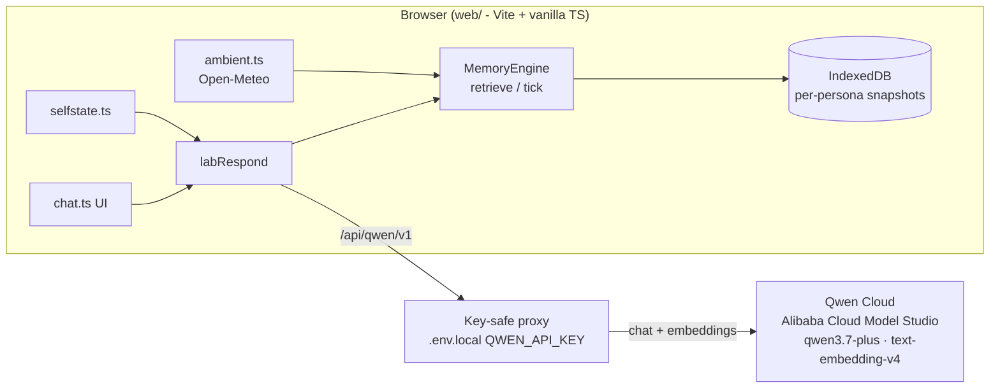

# Living Memory Engine

A TypeScript memory substrate for agents that remember like a mind, not a log — decay, consolidation, crystallization, MMR retrieval. Proven by เชียงใหม่ (Chiang Mai), a city-entity that senses the real world and remembers you across sessions. Runs on Qwen Cloud.

> Experimental side project. Single user, evolving fast. Local-first (Ollama) or Qwen Cloud — your choice, same engine.

## The problem

Most chat apps solve "remembering" the cheap way: stuff the entire conversation back into every prompt until it overflows the context window, or bolt on naive RAG that retrieves by similarity alone and never forgets, contradicts itself, or consolidates what it's learned. Neither models how memory actually works — forgetting is a feature, not a bug: a mind decays what's stale, reinforces what's used, merges duplicates, and crystallizes durable traits out of repetition. Living Memory Engine is built to do exactly that, so an agent can run indefinitely on a small, bounded context window instead of an ever-growing transcript.

## How memory works

```
you ── talk ──▶  retrieve a few relevant memories + recent turns  ──▶  LLM
                        ▲                                               │
                        │                                          reply
              decay · merge · crystallize  ◀── consolidate (tick) ◀────┘
```

- **No context stuffing.** The full history is never re-sent. Each turn retrieves the top-K most relevant memories (semantic search + diversity via MMR) plus a short tail.
- **Memory that settles.** After each turn the engine extracts new episodic memories, embeds them, decays old ones (Ebbinghaus-style), merges duplicates, and crystallizes stable traits into a "self".
- **Senses, not just chat.**
  - *Exteroception* — an ambient loop reads เชียงใหม่'s real weather/air, scores how unusual it is against the city's own learned normal (diurnal z-score, no hardcoded thresholds), remembers it, and may greet you about it.
  - *Interoception* — a `[Self-state]` block tells the entity its own runtime condition (online · local/remote model · embeddings health · world-feed freshness · memory age) so it self-calibrates: speak from memory when the feed is stale, don't fake recall when embeddings are down, know when it's thinking alone.



## Evaluation vs naive baseline

A deterministic script (`engine/eval/run.ts`) drives the real `MemoryEngine` through four hypothesis scenarios (H1–H4) and compares it against a naive "resend full history" baseline. It's a measurement, not a test suite — each row reports whatever actually happened, including scenarios where the hypothesis didn't hold. Reproduce with:

```bash
cd engine && npm run eval
```

Deterministic: seed `1337`, `FakeClock` starting at epoch 0, `FakeEmbed` (a 64-dim bag-of-words hash — lexical overlap only, no real semantics).

This offline harness uses that deterministic **lexical** fake-embedder, so each scenario's query deliberately shares vocabulary with its stored fact — this measures retrieval/decay/MMR/token mechanics reproducibly, not semantic understanding. Semantic paraphrase matching (recognizing an answer that shares no words with the question) is out of scope for this fixture; it's handled by the real embedding model (Qwen `text-embedding-v4`) in the live app.

| Hypothesis | Relevant recalled | Stale recalled | Memories injected | Engine inject tokens | Full-history tokens |
|---|---|---|---|---|---|
| H1 cross-session preference | yes | n/a | 5 | ~42 | ~143 |
| H2 updated preference | yes | YES | 2 | ~25 | ~24 |
| H3 critical in limited window | yes | n/a | 2 | ~23 | ~428 |
| H4 expired memory forgotten | NO | no | 0 | ~0 | ~12 |

**Honest read:** H1, H3, and H4 land as hypothesized — cross-session preference recall, critical-fact surfacing out of 31 candidates, and prune-based forgetting after ~12 weeks all check out at a fraction of full-history tokens. H2 is the more interesting finding, not a clean win: it retrieves *both* the old and new seat preference side-by-side, which documents that consolidation currently doesn't resolve superseded facts (no contradiction-aware merge) — a real product gap, not a script bug.

## Alibaba Cloud deployment proof

**Live, deployed and running on Alibaba Cloud.** The app (static build + the Qwen proxy) runs as a systemd Node service behind nginx on an Alibaba Cloud server — reachable now at **http://47.79.255.217** (HTTPS at `https://cm.viibe.to` once DNS + Let's Encrypt land). All chat and embedding inference runs on **Qwen Cloud / Alibaba Cloud Model Studio** (`https://dashscope-intl.aliyuncs.com/compatible-mode/v1`). So both tiers are on Alibaba Cloud: the backend host *and* the model inference.

The browser never holds the API key — it talks to a same-origin proxy that injects the key server-side and enforces a path/model allowlist and a `max_tokens` cap before forwarding upstream:

- [`web/server.mjs`](web/server.mjs) — the **production server** deployed on Alibaba Cloud: serves the static build and proxies `browser → /api/qwen/v1 → (key from server env) → dashscope-intl.aliyuncs.com`.
- [`web/src/lib/qwenproxy.ts`](web/src/lib/qwenproxy.ts) — pure, unit-tested request rules: allowed paths (`/models`, `/chat/completions`, `/embeddings`), model allowlist (`qwen*` for chat, `text-embedding-v4` for embeddings), forced `dimensions: 768` and `enable_thinking: false`.
- [`web/vite.config.ts`](web/vite.config.ts) — the same proxy as dev middleware for local development.
- [`web/src/lib/config.ts`](web/src/lib/config.ts) — the `qwen` model profile (default; `chat: qwen3.7-plus`, `embed: text-embedding-v4`).

Live-deploy screenshot (เชียงใหม่ answering through the Alibaba-hosted server) is in [`docs/superpowers/hackathon/evidence/`](docs/superpowers/hackathon/evidence).

## Quick start

**Qwen Cloud (recommended — no local model download):**

```bash
echo "QWEN_API_KEY=sk-..." > web/.env.local   # DashScope intl key
cd engine && npm install                       # builds the memory engine (web links it via file:../engine)
cd ../web && npm install && npm run dev         # → http://localhost:5173
```

Open the app, then in the ☰ drawer pick **"Qwen Cloud"** as the profile. Say hi to เชียงใหม่.

**Local-first (Ollama), no keys, no cloud:**

```bash
ollama pull gemma4:e2b embeddinggemma    # a chat model + an embedding model
cd engine && npm install                 # builds the memory engine (web links it via file:../engine)
cd ../web && npm install && npm run dev   # → http://localhost:5173
```

Open the app, say hi to เชียงใหม่. Switch model/provider in the ☰ drawer (Ollama · LM Studio · OpenRouter · OpenAI · Qwen Cloud). Open the 🧠 pane to inspect live memory and tune exactly what the model is fed.

```bash
cd web && npm test          # unit tests
cd web && npx tsc --noEmit  # typecheck
```

## What's inside

| Dir | Role |
|---|---|
| `web/` | The app — Vite + vanilla TypeScript (no framework), IndexedDB storage, the ambient & self-state senses, and a Lab pane to inspect/tune the prompt. |
| `engine/` | `@nature-labs/living-memory-engine` — the framework-agnostic memory engine (decay / consolidation / crystallization / retrieval). Pure ports & adapters; the web app just supplies a browser storage + an OpenAI-compatible LLM port. |
| `mobile/` | An earlier Expo prototype. Frozen — superseded by `web/`. |

The engine is provider-agnostic: any OpenAI-compatible endpoint works (Ollama, LM Studio, OpenRouter, OpenAI, Qwen Cloud). Model names are **discovered** from `/v1/models`, never hardcoded.

## Lab mode

The 🧠 pane is a tuning instrument: a live view of the entity's memory (episodic / self / prospective, with strength and embeddings), the **exact prompt last fed to the model**, per-component toggles for what to inject, and a per-persona brain-wipe to re-run experiments from zero. You can also spin up new personas with a custom system prompt.

## Hackathon note

Submitted to the **MemoryAgent** track. This repo (`neural-chat` — the app is titled "Living Memory Engine" for submission) was significantly updated after May 26, 2026:

- **2026-06-02 → 06-05** — the web pivot (`web/` — Vite + vanilla TS, replacing the frozen Expo app), the ambient world-sensing oracle (`lib/ambient.ts`), interoceptive self-state grounding (`lib/selfstate.ts`), prospective-memory resolution, and Spec 1A attributed multi-person memory (source/subject/interaction ledger — PR [#2](https://github.com/v1b3x0r/neural-chat/pull/2)).
- **2026-07-20** — Qwen Cloud integration (key-safe proxy, `qwen3.7-plus` + `text-embedding-v4`), the deterministic H1–H4 evaluation harness, the memory-lifecycle chip, and a restyle pass.

Test suites: engine 92 passing, web 71 passing.

**Roadmap:** a canonical 24/7 server-side entity (this repo is currently single-session, browser-local), background continuity between sessions, and privacy-scoped retrieval for attributed multi-person memory (Spec 1B).

---

Built as part of the Viibe World OS — a system that knows it is a system.
