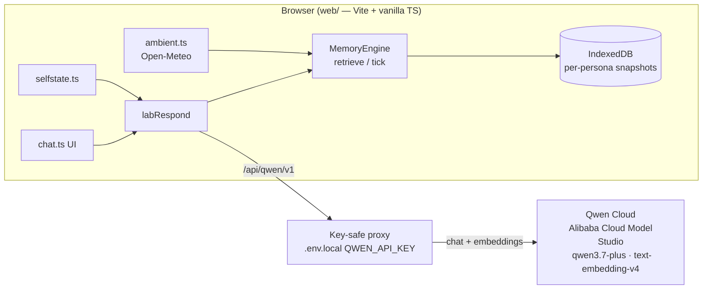

# Qwen Hackathon Submission Implementation Plan

> **For agentic workers:** REQUIRED SUB-SKILL: Use superpowers:subagent-driven-development (recommended) or superpowers:executing-plans to implement this plan task-by-task. Steps use checkbox (`- [ ]`) syntax for tracking.

**Goal:** Ship the "Living Memory Engine" submission (MemoryAgent track) tonight: Qwen Cloud profile via a key-safe dev proxy, Apache-2.0 public repo, evaluation baseline, lifecycle chip + single-theme restyle, video assets, Devpost draft — deadline 2026-07-21 04:00 ICT.

**Architecture:** Zero `engine/src` edits. Web gets a `qwen` ModelProfile pointing at a same-origin `/api/qwen/v1` proxy; a Vite middleware (dev) injects the API key from `web/.env.local` and hardens requests (path/model allowlist, `max_tokens` cap, `dimensions: 768` for embeddings). Evaluation is a standalone `tsx` script in `engine/eval/` reusing the test fakes. Chip = optional `onPhase` callback on web-owned `labRespond`.

**Tech Stack:** Vite 6 + vanilla TS (web), vitest, tsx (engine devDep), gh CLI, GitHub-rendered mermaid.

**Spec:** `docs/superpowers/specs/2026-07-20-qwen-hackathon-submission-design.md` (approved 2026-07-20, advisor rounds A1–A13 incorporated)

## Global Constraints

- **Never edit `engine/src` or `engine/provider`** — `engine/eval/` (new dir) and `engine/package.json` scripts are allowed; `dist/` stays untouched, no rebuild needed.
- **The API key must never reach client code**: no `VITE_` prefix, no key literal in any committed file. Key lives only in `web/.env.local` (gitignored via `*.local`).
- Run web commands as `cd web && …`, engine commands as `cd engine && …`; use `git -C <repo-root>` for git (cwd drift rule).
- Suites must stay green at every commit: web 63+, engine 92, `cd web && npx tsc --noEmit` = 0 errors.
- Commit trailer (repo convention): `Co-Authored-By: Claude Opus 4.8 (1M context) <noreply@anthropic.com>`
- Thai for founder-facing prose, English for code/comments; submission copy in English.
- Fresh-brain rule: any Qwen demo/recording uses 🧹 brain-wipe first (embedding spaces don't mix).
- **R-gate (spec §5):** Task 9 must not start until Tasks 2,4,5,6,7 are done; if gate unmet by 18:00 ICT, Task 9 degrades to 45-min camera-viewport CSS only.

---

### Task 1: Pure proxy rules — `qwenproxy.ts`

**Files:**
- Create: `web/src/lib/qwenproxy.ts`
- Test: `web/test/qwenproxy.test.ts`

**Interfaces:**
- Produces: `QWEN_UPSTREAM_DEFAULT: string`, `allowPath(method: string, path: string): boolean`, `shapeBody(path: string, body: unknown): Record<string, unknown> | null` (null = reject). Consumed by Task 2's vite plugin.

- [ ] **Step 1: Write the failing test**

```ts
// web/test/qwenproxy.test.ts
import { describe, it, expect } from 'vitest';
import { allowPath, shapeBody, QWEN_UPSTREAM_DEFAULT } from '../src/lib/qwenproxy';

describe('allowPath', () => {
  it('allows exactly the three OpenAI-compat routes with correct methods', () => {
    expect(allowPath('GET', '/models')).toBe(true);
    expect(allowPath('POST', '/chat/completions')).toBe(true);
    expect(allowPath('POST', '/embeddings')).toBe(true);
    expect(allowPath('POST', '/models')).toBe(false);
    expect(allowPath('GET', '/chat/completions')).toBe(false);
    expect(allowPath('POST', '/files')).toBe(false);
  });
});

describe('shapeBody', () => {
  it('chat: rejects non-qwen models', () => {
    expect(shapeBody('/chat/completions', { model: 'gpt-4o-mini' })).toBeNull();
  });
  it('chat: caps max_tokens at 2048 and disables thinking', () => {
    const b = shapeBody('/chat/completions', { model: 'qwen3.7-plus', max_tokens: 999999 })!;
    expect(b.max_tokens).toBe(2048);
    expect(b.enable_thinking).toBe(false);
  });
  it('chat: defaults max_tokens when absent', () => {
    expect(shapeBody('/chat/completions', { model: 'qwen3.6-flash' })!.max_tokens).toBe(2048);
  });
  it('embeddings: only text-embedding-v4, forces 768 dims', () => {
    expect(shapeBody('/embeddings', { model: 'nomic-embed-text' })).toBeNull();
    const b = shapeBody('/embeddings', { model: 'text-embedding-v4', input: 'x' })!;
    expect(b.dimensions).toBe(768);
  });
  it('exports the verified upstream default', () => {
    expect(QWEN_UPSTREAM_DEFAULT).toBe('https://dashscope-intl.aliyuncs.com/compatible-mode/v1');
  });
});
```

- [ ] **Step 2: Run test to verify it fails** — `cd web && npx vitest run test/qwenproxy.test.ts` → FAIL (module not found)

- [ ] **Step 3: Implement**

```ts
// web/src/lib/qwenproxy.ts
// Pure request rules for the /api/qwen proxy (dev middleware now, deploy function later).
// The proxy — not the browser — holds the API key; these rules keep the $40 credit safe:
// path allowlist, model allowlist, max_tokens cap, and server-side dimensions/thinking params
// so neither engine provider ports nor web adapters change (zero engine edits).
export const QWEN_UPSTREAM_DEFAULT = 'https://dashscope-intl.aliyuncs.com/compatible-mode/v1';

const ALLOWED: Record<string, string> = {
  '/models': 'GET',
  '/chat/completions': 'POST',
  '/embeddings': 'POST',
};

export function allowPath(method: string, path: string): boolean {
  return ALLOWED[path] === method;
}

export function shapeBody(path: string, body: unknown): Record<string, unknown> | null {
  const b = (body ?? {}) as Record<string, unknown>;
  const model = String(b.model ?? '');
  if (path === '/chat/completions') {
    if (!/^qwen/i.test(model)) return null;
    return { ...b, max_tokens: Math.min(Number(b.max_tokens) || 2048, 2048), enable_thinking: false };
  }
  if (path === '/embeddings') {
    if (model !== 'text-embedding-v4') return null;
    return { ...b, dimensions: 768 };
  }
  return b;
}
```

- [ ] **Step 4: Run test to verify it passes** — `cd web && npx vitest run test/qwenproxy.test.ts` → PASS
- [ ] **Step 5: Commit**

```bash
git -C /Users/v1b3_/_dev/project-world-log/side-projects/memory-engine add web/src/lib/qwenproxy.ts web/test/qwenproxy.test.ts
git -C /Users/v1b3_/_dev/project-world-log/side-projects/memory-engine commit -m "feat(web): pure request rules for the Qwen Cloud proxy

Co-Authored-By: Claude Opus 4.8 (1M context) <noreply@anthropic.com>"
```

---

### Task 2: Vite dev proxy + `qwen` profile

**Files:**
- Modify: `web/vite.config.ts` (wrap config in function form, add `qwenProxy` plugin)
- Modify: `web/src/lib/config.ts:8-21` (add profile to `PROFILES`)
- Test: `web/test/config.test.ts` (append)

**Interfaces:**
- Consumes: Task 1 exports.
- Produces: profile id `'qwen'` with `chat.baseURL === '/api/qwen/v1'`; dev route `/api/qwen/v1/*`. The app's existing `getChatCfg()`/`getEmbedCfg()`/`fetchModels()` need no changes (relative baseURL is same-origin).

- [ ] **Step 1: Append failing test to `web/test/config.test.ts`**

```ts
// append to web/test/config.test.ts
import { PROFILES } from '../src/lib/config';

describe('qwen profile', () => {
  it('exists, points at the same-origin proxy, and never needs a client key', () => {
    const q = PROFILES.find(p => p.id === 'qwen')!;
    expect(q).toBeTruthy();
    expect(q.chat.baseURL).toBe('/api/qwen/v1');
    expect(q.embed.baseURL).toBe('/api/qwen/v1');
    expect(q.embed.model).toBe('text-embedding-v4');
    expect(q.needsKey).toBeFalsy();
  });
});
```
(If the file already imports `PROFILES` or `describe`, merge imports instead of duplicating.)

- [ ] **Step 2: Run** — `cd web && npx vitest run test/config.test.ts` → FAIL (`q` undefined)

- [ ] **Step 3: Add the profile to `web/src/lib/config.ts`** (after the `openai` entry, inside `PROFILES`)

```ts
  { id: 'qwen', label: 'Qwen Cloud',                  // hackathon profile — key lives server-side (web/.env.local → /api/qwen proxy)
    chat:  { baseURL: '/api/qwen/v1', model: 'qwen3.7-plus' },
    embed: { baseURL: '/api/qwen/v1', model: 'text-embedding-v4' } },
```

- [ ] **Step 4: Run** — `cd web && npx vitest run test/config.test.ts` → PASS

- [ ] **Step 5: Add the proxy plugin to `web/vite.config.ts`** — convert the exported object to function form so `loadEnv` sees `web/.env.local` (no-prefix load = non-VITE vars included):

```ts
import { defineConfig, loadEnv, type Plugin } from 'vitest/config';
import { appendFile, mkdir } from 'node:fs/promises';
import { fileURLToPath } from 'node:url';
import { dirname } from 'node:path';
import { QWEN_UPSTREAM_DEFAULT, allowPath, shapeBody } from './src/lib/qwenproxy';

// ... keep devlogSink() exactly as is ...

// Dev-only proxy: browser → /api/qwen/v1/* → DashScope intl, with the key injected
// server-side from web/.env.local (QWEN_API_KEY — deliberately NOT VITE_-prefixed).
function qwenProxy(env: Record<string, string>): Plugin {
  const upstream = env.QWEN_BASE_URL || QWEN_UPSTREAM_DEFAULT;
  const key = env.QWEN_API_KEY || '';
  return {
    name: 'qwen-proxy',
    apply: 'serve',
    configureServer(server) {
      server.middlewares.use('/api/qwen/v1', (req, res) => {
        void (async () => {
          const path = (req.url ?? '').split('?')[0] ?? '';
          if (!key) { res.statusCode = 500; return void res.end('QWEN_API_KEY missing in web/.env.local'); }
          if (!allowPath(req.method ?? '', path)) { res.statusCode = 403; return void res.end('blocked'); }
          let body: string | undefined;
          if (req.method === 'POST') {
            const chunks: Buffer[] = [];
            for await (const c of req) chunks.push(c as Buffer);
            const shaped = shapeBody(path, JSON.parse(Buffer.concat(chunks).toString('utf8') || '{}'));
            if (shaped === null) { res.statusCode = 403; return void res.end('model not allowed'); }
            body = JSON.stringify(shaped);
          }
          const up = await fetch(`${upstream}${path}`, {
            method: req.method ?? 'GET',
            headers: { 'Content-Type': 'application/json', Authorization: `Bearer ${key}` },
            ...(body ? { body } : {}),
          });
          res.statusCode = up.status;
          res.setHeader('Content-Type', up.headers.get('content-type') ?? 'application/json');
          if (!up.body) return void res.end();
          for await (const chunk of up.body as unknown as AsyncIterable<Uint8Array>) res.write(chunk);
          res.end();
        })().catch(err => { res.statusCode = 502; res.end(String(err)); });
      });
    },
  };
}

export default defineConfig(({ mode }) => {
  const env = loadEnv(mode, dirname(fileURLToPath(import.meta.url)), '');
  return {
    plugins: [devlogSink(), qwenProxy(env)],
    optimizeDeps: { exclude: ['@nature-labs/living-memory-engine'] },
    test: { environment: 'happy-dom' },
  };
});
```

- [ ] **Step 6: Full suite + typecheck** — `cd web && npm test && npx tsc --noEmit` → all green, 0 errors

- [ ] **Step 7: Live round-trip verify (restart dev server — vite.config changed)** — `cd web && npm run dev`, then in another shell:

```bash
curl -sS http://localhost:5173/api/qwen/v1/models | head -c 300          # expect model list JSON
curl -sS -X POST http://localhost:5173/api/qwen/v1/chat/completions -H 'Content-Type: application/json' \
  -d '{"model":"qwen3.6-flash","messages":[{"role":"user","content":"Say OK"}],"stream":true}' | head -c 400   # expect SSE data: lines
curl -sS -X POST http://localhost:5173/api/qwen/v1/chat/completions -H 'Content-Type: application/json' \
  -d '{"model":"gpt-4o-mini","messages":[]}'                              # expect "model not allowed"
```
**If chat returns HTTP 400 mentioning `enable_thinking`:** delete `enable_thinking: false` from `shapeBody` + its test assertion (the stream parser already skips `reasoning_content` deltas — `engine/provider/openaiCompat.ts:44` reads only `delta.content`).

Then in the browser (http://localhost:5173): drawer → profile **Qwen Cloud** → 🧹 brain-wipe → send a message → reply streams; 🧠 pane shows episodic with embeddings after tick. Check `web/.debug/dev.log` `last-fed` for the real prompt.

- [ ] **Step 8: Commit**

```bash
git -C /Users/v1b3_/_dev/project-world-log/side-projects/memory-engine add web/vite.config.ts web/src/lib/config.ts web/test/config.test.ts
git -C /Users/v1b3_/_dev/project-world-log/side-projects/memory-engine commit -m "feat(web): Qwen Cloud profile via key-safe dev proxy (path/model allowlist, 768-dim embed)

Co-Authored-By: Claude Opus 4.8 (1M context) <noreply@anthropic.com>"
```

---

### Task 3: Apache-2.0 license + package metadata

**Files:**
- Create: `LICENSE` (repo root)
- Modify: `engine/package.json`, `web/package.json` (add `"license": "Apache-2.0"`)

- [ ] **Step 1:** `cd /Users/v1b3_/_dev/project-world-log/side-projects/memory-engine && curl -sL https://www.apache.org/licenses/LICENSE-2.0.txt -o LICENSE` — verify: `head -3 LICENSE` shows "Apache License / Version 2.0, January 2004".
- [ ] **Step 2:** In both `engine/package.json` and `web/package.json`, add `"license": "Apache-2.0",` after the `"private": true,` line.
- [ ] **Step 3:** Sanity: `cd engine && npm test` (92 green) and `cd web && npm test` — package.json edits can't break tests, but the gate is cheap.
- [ ] **Step 4: Commit**

```bash
git -C /Users/v1b3_/_dev/project-world-log/side-projects/memory-engine add LICENSE engine/package.json web/package.json
git -C /Users/v1b3_/_dev/project-world-log/side-projects/memory-engine commit -m "chore: Apache-2.0 license (repo + package metadata)

Co-Authored-By: Claude Opus 4.8 (1M context) <noreply@anthropic.com>"
```

---

### Task 4: Secrets scan → push → repo public

**Files:** none created (audit + remote ops)

- [ ] **Step 1: Confirm the key file is untracked** — `git -C <root> check-ignore web/.env.local` prints the path (ignored ✓). Also `git -C <root> status --porcelain | grep -v '^??'` shows only intended changes.
- [ ] **Step 2: History secrets scan** (full history, all branches):

```bash
git -C /Users/v1b3_/_dev/project-world-log/side-projects/memory-engine log --all -p | \
  grep -nEi '(sk-[A-Za-z0-9_.-]{8,}|api[_-]?key[^A-Za-z]{0,3}[:=][^ ]{8,}|Bearer [A-Za-z0-9_.-]{16,}|ghp_[A-Za-z0-9]{20,})' | \
  grep -vEi '(VITE_OPENROUTER_API_KEY|apiKey ?[:=] ?(''|""|cfg\.apiKey|p\.needsKey)|Authorization: .Bearer \$\{)' || echo CLEAN
```
Expected: `CLEAN` (code references to the *word* apiKey are fine; any real token = STOP, tell founder before going public).
- [ ] **Step 3: Push** — `git -C <root> push origin main` (merged `79390a9`+tonight's commits go up).
- [ ] **Step 4: Flip public** — `gh repo edit v1b3x0r/neural-chat --visibility public --accept-visibility-change-consequences`, then verify `gh repo view v1b3x0r/neural-chat --json visibility` → `PUBLIC` and the repo page shows the Apache-2.0 badge (license detectability — spec §4.3).

---

### Task 5: README rewrite (engine-first) + mermaid architecture

**Files:**
- Modify: `README.md` (rewrite)

- [ ] **Step 1: Rewrite `README.md`** with this structure (keep existing accurate content where it fits; English):
  1. **Title:** `# Living Memory Engine` + one-liner: *"A TypeScript memory substrate for agents that remember like a mind, not a log — decay, consolidation, crystallization, MMR retrieval. Proven by เชียงใหม่ (Chiang Mai), a city-entity that senses the real world and remembers you across sessions. Runs on Qwen Cloud."*
  2. **The problem** (3 lines: full-history stuffing vs naive RAG).
  3. **How memory works** — keep the existing ASCII loop diagram, add the mermaid architecture block:

  4. **Evaluation** — placeholder heading `## Evaluation vs naive baseline` with the sentence "Reproduce with `cd engine && npm run eval`" (table pasted by Task 6).
  5. **Alibaba Cloud deployment proof** section: links to `web/src/lib/qwenproxy.ts`, `web/vite.config.ts`, `web/src/lib/config.ts` ("all chat + embedding inference runs on Qwen Cloud / Alibaba Cloud Model Studio"), screenshots note (founder's console captures land in `docs/superpowers/hackathon/evidence/`).
  6. **Quick start** — Qwen Cloud first (`web/.env.local` → `QWEN_API_KEY=...`, then engine install + web dev, pick "Qwen Cloud" in drawer), local-first Ollama mode second (keep existing commands).
  7. **What's inside** table + **Lab mode** section: keep from current README.
  8. **Hackathon note:** MemoryAgent track; significantly-updated-after-May-26 evidence list (2026-06-02..05 web pivot / ambient oracle / self-state / prospective-resolution / Spec 1A attributed memory PR #2; 2026-07-20 Qwen Cloud integration, evaluation, lifecycle chip, restyle). Roadmap: canonical 24/7 server-side entity, background continuity.
- [ ] **Step 2: Verify rendering** — push branch-less quick check: `gh repo view v1b3x0r/neural-chat --web` after Step 3's push (mermaid renders on GitHub natively).
- [ ] **Step 3: Commit + push**

```bash
git -C /Users/v1b3_/_dev/project-world-log/side-projects/memory-engine add README.md
git -C /Users/v1b3_/_dev/project-world-log/side-projects/memory-engine commit -m "docs: engine-first README — architecture, Qwen quick start, deployment proof, hackathon evidence

Co-Authored-By: Claude Opus 4.8 (1M context) <noreply@anthropic.com>"
git -C /Users/v1b3_/_dev/project-world-log/side-projects/memory-engine push origin main
```

---

### Task 6: Evaluation script (scope E)

**Files:**
- Create: `engine/eval/run.ts`
- Modify: `engine/package.json` (add script `"eval": "tsx eval/run.ts"`)
- Modify: `README.md` (paste the produced table under `## Evaluation vs naive baseline`)

**Interfaces:**
- Consumes: `MemoryEngine`, `SeededRandom`, `randomK`, `formatInjection` from `../src/index.js`; `FakeClock`, `InMemoryStorage`, `FakeEmbed`, `FakeChat` from `../test/fakes.js` (all existing).
- Produces: deterministic markdown table on stdout (measured, never asserted — hypotheses H1–H4 per spec §5.5).

- [ ] **Step 1: Add the npm script** in `engine/package.json` scripts: `"eval": "tsx eval/run.ts",`

- [ ] **Step 2: Write `engine/eval/run.ts`** (complete file):

```ts
// Deterministic evaluation: Living Memory Engine vs a naive full-history baseline.
// Hypotheses (H1-H4) are MEASURED, not asserted — whatever happens is reported.
// Seed 1337, FakeClock epoch 0, FakeEmbed 64-dim bag-of-words. Reproduce: npm run eval
import { MemoryEngine, SeededRandom, randomK, formatInjection } from '../src/index.js';
import { FakeClock, InMemoryStorage, FakeEmbed, FakeChat } from '../test/fakes.js';

const est = (s: string) => Math.ceil(s.length / 4); // ~4 chars/token

function makeEngine() {
  const clock = new FakeClock(0);
  const storage = new InMemoryStorage();
  const chat = new FakeChat();
  const engine = new MemoryEngine({
    storage, chat, embed: new FakeEmbed(),
    clock, random: new SeededRandom(1337), policy: randomK(3, 7), systemPrompt: '',
  });
  return { engine, clock, chat, storage };
}

// One remembered exchange: user says `text`, model acks, extract yields `facts`.
async function remember(e: ReturnType<typeof makeEngine>, text: string, facts: string[], importance = 7) {
  await e.engine.ingestUser(text);
  await e.engine.ingestModel('noted.');
  e.chat.extractQueue.push({ episodic: facts.map(content => ({ content, importance, tags: [] })), prospective: [] });
  await e.engine.tick();
}

interface Row { h: string; relevant: string; stale: string; injected: number; engineTok: number; baselineTok: number }
const rows: Row[] = [];

async function measure(h: string, e: ReturnType<typeof makeEngine>, query: string, relevantNeedle: string, staleNeedle: string | null) {
  const ctx = await e.engine.retrieve(query);
  const inject = formatInjection(ctx);
  const contents = ctx.episodic.map(m => m.content);
  const baseline = e.storage.snap.messages.map(m => m.text).join('\n');
  rows.push({
    h,
    relevant: contents.some(c => c.includes(relevantNeedle)) ? 'yes' : 'NO',
    stale: staleNeedle === null ? 'n/a' : contents.some(c => c.includes(staleNeedle)) ? 'YES' : 'no',
    injected: ctx.episodic.length,
    engineTok: est(inject),
    baselineTok: est(baseline),
  });
  console.log(`\n${h} retrieved:`, contents.map((c, i) => `${c} (s=${ctx.episodic[i]!.strength.toFixed(2)})`));
}

// H1 — preference recall across sessions
{
  const e = makeEngine();
  await remember(e, 'By the way, I only drink oat-milk flat whites.', ['User prefers oat-milk flat whites']);
  for (let i = 0; i < 8; i++) await remember(e, `Filler chat about topic ${i}: markets, rain, trains, code.`, [`Talked about topic ${i}`], 4);
  e.clock.advanceDays(2); // new session
  await measure('H1 cross-session preference', e, 'what coffee should you make me?', 'oat-milk', null);
}
// H2 — preference updated later (old vs new at retrieval)
{
  const e = makeEngine();
  await remember(e, 'I always want a window seat.', ['User prefers window seat']);
  e.clock.advanceDays(10);
  await remember(e, 'Actually I changed my mind — aisle seat from now on.', ['User now prefers aisle seat (changed from window)']);
  e.clock.advanceDays(1);
  await measure('H2 updated preference', e, 'which seat do I want?', 'aisle', 'window seat');
}
// H3 — limited context: small working set out of many memories
{
  const e = makeEngine();
  for (let i = 0; i < 30; i++) await remember(e, `Note ${i}: ordinary day, groceries, weather fine.`, [`Ordinary note ${i}`], 3);
  await remember(e, 'CRITICAL: my medication is levothyroxine, 50mcg every morning.', ['User medication levothyroxine 50mcg each morning'], 10);
  e.clock.advanceDays(1);
  await measure('H3 critical in limited window', e, 'remind me about my medication', 'levothyroxine', null);
}
// H4 — expired memory decays out
{
  const e = makeEngine();
  await remember(e, 'Temporary wifi password is tulip-9931.', ['Temporary wifi password tulip-9931'], 2);
  for (let w = 0; w < 12; w++) { e.clock.advanceDays(7); await e.engine.tick(); }
  await measure('H4 expired memory forgotten', e, 'what is the wifi password?', 'tulip-9931', 'tulip-9931');
}

console.log('\n| Hypothesis | Relevant recalled | Stale recalled | Memories injected | Engine inject tokens | Full-history tokens |');
console.log('|---|---|---|---|---|---|');
for (const r of rows) console.log(`| ${r.h} | ${r.relevant} | ${r.stale} | ${r.injected} | ~${r.engineTok} | ~${r.baselineTok} |`);
console.log('\nDeterministic: seed 1337, FakeClock (epoch 0), FakeEmbed 64-dim bag-of-words. Findings are measured, not asserted.');
```
Note: H4's `stale` column doubles as "was the expired memory still retrieved" (same needle) — `relevant: NO` + `stale: no` is the *hoped* outcome, but print whatever happens.

- [ ] **Step 3: Run** — `cd engine && npm run eval` → table prints; if a type/API mismatch appears (e.g. `ExtractResult` requires more fields), adapt the script — NOT `engine/src`.
- [ ] **Step 4: Interpret honestly** — paste the real table + 2-sentence honest interpretation into README `## Evaluation vs naive baseline` (if H2 retrieves both seats, write that it documents where consolidation-resolution stands — finding, not failure).
- [ ] **Step 5: Engine suite still green** — `cd engine && npm test` → 92 pass (eval dir is outside test glob; verify no accidental pickup).
- [ ] **Step 6: Commit + push**

```bash
git -C /Users/v1b3_/_dev/project-world-log/side-projects/memory-engine add engine/eval/run.ts engine/package.json README.md
git -C /Users/v1b3_/_dev/project-world-log/side-projects/memory-engine commit -m "feat(eval): deterministic memory-vs-baseline evaluation (H1-H4, measured findings)

Co-Authored-By: Claude Opus 4.8 (1M context) <noreply@anthropic.com>"
git -C /Users/v1b3_/_dev/project-world-log/side-projects/memory-engine push origin main
```

---

### Task 7: Devpost description draft + evidence folder

**Files:**
- Create: `docs/superpowers/hackathon/devpost-draft.md`
- Create: `docs/superpowers/hackathon/evidence/` (founder's Qwen Cloud console screenshots land here; commit whatever exists by submit time)

- [ ] **Step 1: Write `devpost-draft.md`** (English; founder pastes into Devpost) with sections: **Inspiration** (talk forever to an entity; context windows are not memory) · **What it does** (decay/consolidate/crystallize + MMR working set; เชียงใหม่ senses real weather/air + self-state) · **How we built it** (ports & adapters; Qwen Cloud chat+embeddings via key-safe proxy — link the three proof files; IndexedDB; 155+ tests) · **Evaluation** (paste Task 6 table) · **Alibaba Cloud deployment** (honest §6a wording from the spec — Qwen Cloud inference evidence + screenshots + pending-KYC note if still true) · **Significantly updated since May 26** (dated list from spec §4.5b) · **What's next** (canonical 24/7 entity, background continuity, privacy-scoped retrieval 1B) · **Track:** MemoryAgent.
- [ ] **Step 2: Commit** (same trailer convention; message `docs: Devpost submission draft + evidence folder`).

---

### Task 8: B1 lifecycle chip (`onPhase`)

**Files:**
- Modify: `web/src/lib/labrespond.ts:35` (add optional `onPhase` param)
- Modify: `web/src/ui/chat.ts` (chip element + callback wiring)
- Modify: `web/src/styles.css` (`.phase` style)
- Test: `web/test/labrespond.test.ts` (append)

**Interfaces:**
- Produces: `export type TurnPhase = 'recall' | 'stream' | 'consolidate' | 'idle'`; `labRespond(engine, chatPort, ns, systemPrompt, text, onPhase?: (p: TurnPhase) => void)` — existing 5-arg callers unaffected.

- [ ] **Step 1: Append failing test to `web/test/labrespond.test.ts`**

```ts
import { labRespond, type TurnPhase } from '../src/lib/labrespond';
import type { MemoryEngine, ChatPort } from '@nature-labs/living-memory-engine';

describe('labRespond phases', () => {
  it('reports recall → stream → consolidate → idle in order', async () => {
    const phases: TurnPhase[] = [];
    const engine = {
      ingestUser: async () => {}, ingestModel: async () => {}, tick: async () => {},
      retrieve: async () => ({ selfTier: [], episodic: [], prospective: [], tail: [] }),
    } as unknown as MemoryEngine;
    const chatPort = { stream: async function* () { yield 'hi'; } } as unknown as ChatPort;
    for await (const _ of labRespond(engine, chatPort, 'test-ns', '', 'hello', p => phases.push(p))) { /* drain */ }
    expect(phases).toEqual(['recall', 'stream', 'consolidate', 'idle']);
  });
});
```

- [ ] **Step 2: Run** — `cd web && npx vitest run test/labrespond.test.ts` → FAIL (TurnPhase not exported)

- [ ] **Step 3: Implement in `labrespond.ts`** — add above `labRespond`:

```ts
export type TurnPhase = 'recall' | 'stream' | 'consolidate' | 'idle';
```
Change the signature to `…, text: string, onPhase?: (p: TurnPhase) => void)` and weave calls: `onPhase?.('recall')` as the first line of the function; `onPhase?.('stream')` immediately before the `for await` chunk loop; `onPhase?.('consolidate')` immediately after that loop (before `ingestModel`); `onPhase?.('idle')` after `tick()`.

- [ ] **Step 4: Run full web suite + tsc** — `cd web && npm test && npx tsc --noEmit` → green, 0.

- [ ] **Step 5: Wire the chip in `chat.ts`** — in the `root.innerHTML` template, after the `#banner` line add:

```html
      <div id="phase" class="phase" hidden></div>
```
After `const composer = …` add `const phase = q<HTMLElement>('#phase');` and inside `submit()` replace the `labRespond(...)` call with:

```ts
      const PHASE_TEXT: Record<TurnPhase, string> = { recall: '🔍 กำลังนึกความจำ…', stream: '', consolidate: '🧠 กำลังตกตะกอนความจำ…', idle: '' };
      const onPhase = (p: TurnPhase) => { if (!stillHere()) return; phase.textContent = PHASE_TEXT[p]; phase.hidden = !PHASE_TEXT[p]; };
      for await (const chunk of labRespond(engine, chatPort, persona.id, persona.systemPrompt ?? '', text, onPhase)) { if (stillHere()) { reply.textContent += chunk; thread.scrollTop = thread.scrollHeight; } }
```
(import `type TurnPhase` alongside `labRespond`; in the `finally` block add `phase.hidden = true;`).

- [ ] **Step 6: Style in `styles.css`** (match existing token/naming conventions in the file):

```css
.phase { font-size: 0.8rem; opacity: 0.65; padding: 2px 12px; }
```

- [ ] **Step 7: Verify live** — dev server, Qwen profile: chip shows 🔍 before first token, 🧠 after the reply while extract runs (the visible seconds-long tail), then disappears. `npm test` + `tsc` still green.
- [ ] **Step 8: Commit** — `feat(web): memory-lifecycle chip driven by real labRespond phases`.

---

### Task 9: R — single-theme restyle (GATED)

**Files:**
- Modify: `web/src/styles.css` (primary), `web/index.html` (fonts/meta only if needed)
- Modify: only presentational attributes in `web/src/ui/*.ts` templates if unavoidable — **no logic/DOM-structure changes** (spec §5 restyle-not-restructure)

- [ ] **Step 1: R-gate check** — Tasks 2,4,5,6,7 done? Past 18:00 ICT? If gate failed → 45-min degraded mode (camera-viewport CSS only).
- [ ] **Step 2: Invoke `design-taste-frontend` skill** with brief: warm/atmospheric/modern-Thai identity for เชียงใหม่; single theme chosen for camera; borrow the Qwen MemoryAgent mockup's clean spatial language + status-chip legibility, not its palette; surfaces = topbar, thread bubbles, composer, chip, drawer, 🧠 pane.
- [ ] **Step 3:** Implement per the skill's pre-flight; hard stop 2h after start.
- [ ] **Step 4: Verify** — `cd web && npm test && npx tsc --noEmit` green; Playwright pass: open app → greet renders → send message streams → 🧠 pane opens → drawer opens.
- [ ] **Step 5: Commit** — `style(web): single-theme restyle for submission demo`+ push.

---

### Task 10: Video script + .srt

**Files:**
- Create: `docs/superpowers/hackathon/video-script.md` (shot-by-shot, Thai VO + English burn-in lines, timed to spec §7 beats, **total ≤2:50**)
- Create: `docs/superpowers/hackathon/subtitles.srt` (English, timed to the script)

- [ ] **Step 1:** Write both files following spec §7's beat table exactly (0:00 cross-session recall hook → 0:20 problem → 0:45 lifecycle in 🧠 pane → 1:25 Injection Tap → 1:55 evaluation table → 2:20 ambient greet → 2:40 Qwen console usage dashboard + repo URL). Include a pre-flight checklist at the top: Qwen profile on, 🧹 fresh brain, a "previous session" seeded with one preference, console usage page open in a tab.
- [ ] **Step 2:** Commit (`docs: video script + subtitles`), hand to founder for recording (burn-in subs — YouTube CC alone is not enough).

---

### Task 11: Final verification + submission checklist

- [ ] **Step 1:** Run everything: `cd engine && npm test` (92) · `cd web && npm test && npx tsc --noEmit` · `cd engine && npm run eval` (table reproduces).
- [ ] **Step 2:** Invoke the `verify` skill on the app flow (Qwen profile end-to-end).
- [ ] **Step 3:** Walk spec §8 checklist item-by-item against reality (repo public + license detectable, README proof links live, evidence screenshots committed, video under 3:00 uploaded, description pasted, track selected). Anything missing → fix now.
- [ ] **Step 4:** Founder clicks **Submit** on Devpost. Screenshot the confirmation.

---

## Self-Review (done at write time)

- **Spec coverage:** §2→T1/T2 · §3→T2 · §4→T3/T4/T5 · §5 B1→T8, R→T9 (B2 dropped ✓) · §5.5→T6 · §6a→T5.5+T7 evidence folder (founder screenshots; honest wording) · §6b deferred (no task ✓ per founder) · §7→T10 · §8→T11 · blog (C) intentionally unplanned — buffer-only, post-submit.
- **Placeholder scan:** clean — every code step has full code; content tasks carry full outlines + key copy.
- **Type consistency:** `TurnPhase`/`onPhase` consistent T8 test↔impl; `allowPath`/`shapeBody`/`QWEN_UPSTREAM_DEFAULT` consistent T1↔T2; eval uses only exports verified to exist (`MemoryEngine`, `SeededRandom`, `randomK`, `formatInjection`, fakes).
- **Known judgment calls:** `enable_thinking:false` has an explicit 400-fallback (T2 S7); eval adapts to `ExtractResult` shape without touching engine/src (T6 S3).
